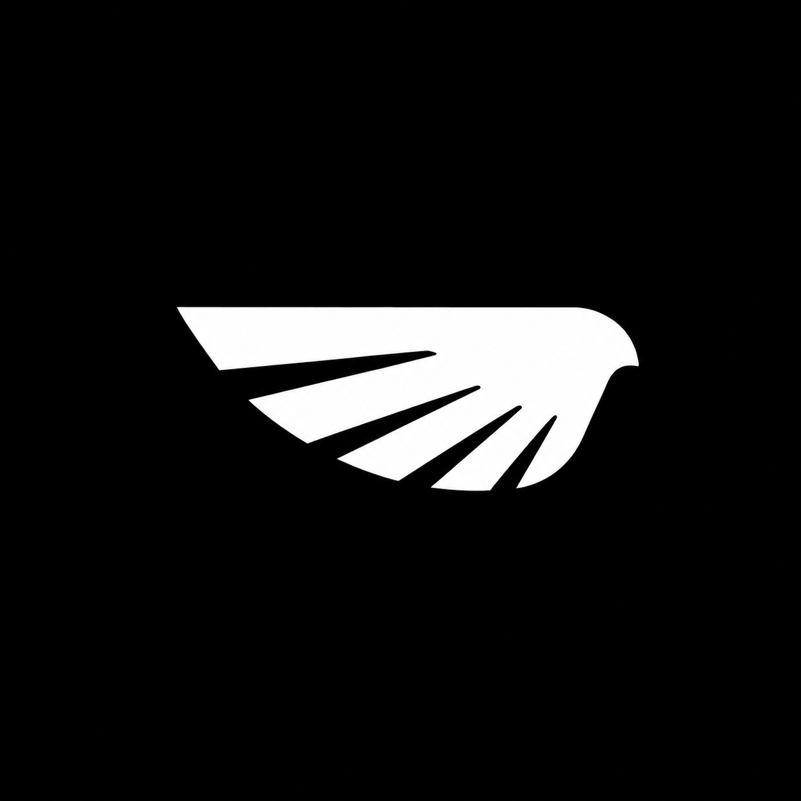
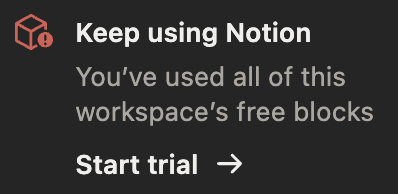

<div align="center">
    
</div>

---

<div align="center">
    <h1>Wings</h1>
    <p>Block editor for notes with nested pages, LaTeX math, Excalidraw drawings, and a BYOK AI panel.</p>
    <p>
        <a href="https://github.com/Sabique-Islam/wings/actions/workflows/editor-regression.yml"></a>
        <a href="https://wings.nopejs.me"></a>
        <a href="https://react.dev"></a>
        <a href="https://www.typescriptlang.org"></a>
        <a href="https://vitejs.dev"></a>
        <a href="https://supabase.com"></a>
        <a href="https://tiptap.dev"></a>
        <a href="https://bun.sh"></a>
        <a href="https://github.com/Sabique-Islam/wings/blob/master/LICENSE"></a>
    </p>
    <p>
        <a href="https://wings.nopejs.me">Live app</a>
        · <a href="https://wings.nopejs.me/docs">Docs</a>
        · <a href="https://wings.nopejs.me/blog">Blog</a>
        · <a href="https://discord.gg/mJsCnBHr">Discord</a>
        · <a href="https://wings.nopejs.me/legal/security">Security</a>
    </p>
</div>

---

## Features

- Nested pages and a TipTap block editor with slash commands
- LaTeX math and Excalidraw drawings in the same note
- BYOK AI panel (⌘J) with page context; keys stay in the browser
- Public share links and email invites
- Markdown / JSON export and local draft cache
- Guards against empty overwrites of substantial notes

## History



I hit my Notion workspace limit in February 2026 and spun this up on Lovable. Intended just for myself with no future plans.

It grew anyway. Friends liked it. I still work on it occasionally, fixing bugs or adding features as requested or if I feel the lack of something.

Migrated from Lovable to a personal stack in July 2026. Write-up: [Why Wings exists](https://wings.nopejs.me/blog/why-wings-exists).

---

## Development

```sh
cp .env.example .env   # fill Supabase and related keys
npm install --legacy-peer-deps
npm run dev
```

CI and some scripts use [Bun](https://bun.sh) (`bun run test:ci`). Local day-to-day works with npm.

More setup: [.github/LOCAL_SETUP.md](.github/LOCAL_SETUP.md) · [CONTRIBUTING.md](.github/CONTRIBUTING.md)

### After content deploy (Bing / IndexNow)

Verify the site in [Bing Webmaster Tools](https://www.bing.com/webmasters) (import from Google Search Console is fine). Then notify participating engines of sitemap URLs:

```sh
bun run indexnow
```

Key file is hosted at `/6ab4230d7edd3da701967b8b96d715b3.txt`. Re-run after publishing blog posts or major page updates.

---

## License

[GNU Affero General Public License v3.0 or later (AGPL-3.0)](https://github.com/Sabique-Islam/wings/blob/master/LICENSE). Strong copyleft. Network use (SaaS) triggers source-offer obligations. See [CONTRIBUTING.md](https://github.com/Sabique-Islam/wings/blob/master/.github/CONTRIBUTING.md).
